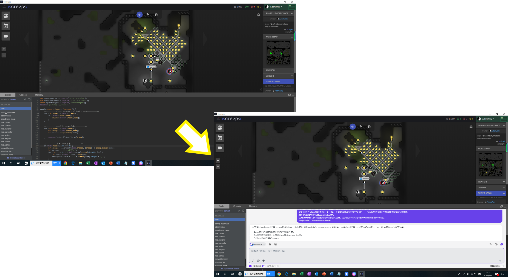

# Rules-Project
Language based game unit control system

## 【愿景View】
为玩家带来**极低门槛**，**超高自由度**的游戏体验。

## 【产品目标】
基于**自然语言交互**的游戏角色**行为自定义**系统。

## 【产品路径】
1. 基于开源沙盒RPG/SLG游戏，利用LLM和框架工具搭建自然语言定义游戏角色行为树的对话框插件。

