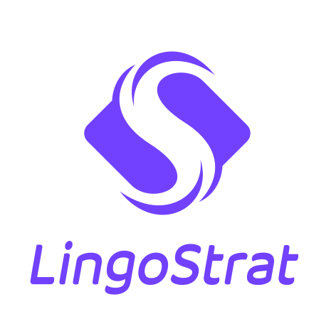
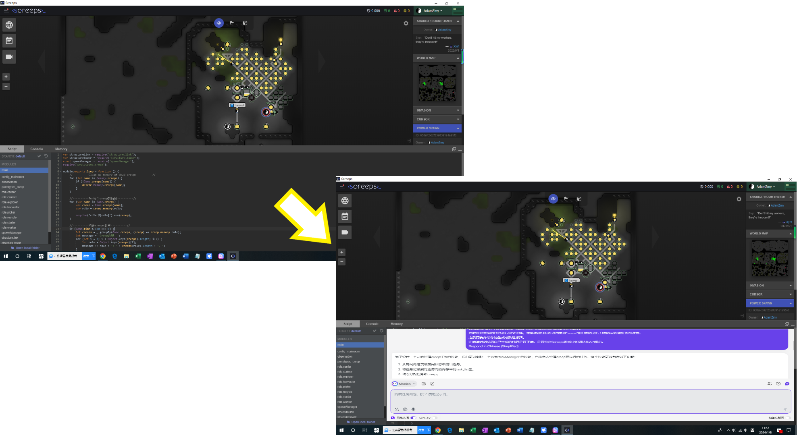

# StratLingo AI：Dialogue-powered Behavior-Tree Strategy 

<b>基于自然语言交互的游戏角色行为自定义系统</b>

## 【愿景View】
为玩家带来**极低门槛**，**超高自由度**的游戏体验。

## 【产品路径】
1. 基于开源沙盒RPG/SLG游戏，利用LLM和框架工具搭建自然语言定义游戏角色行为树的对话框插件。

## 👨‍💻‍ Contributors

Made with [contrib.rocks](https://contrib.rocks).
